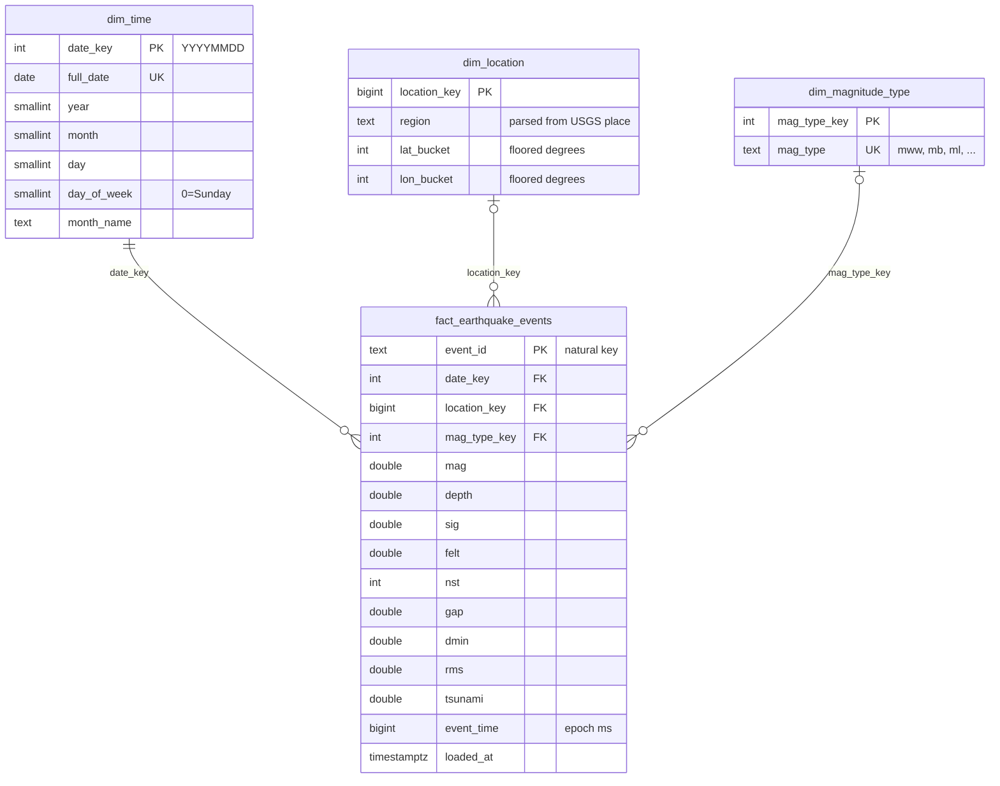

# ETL Pipeline


USGS Earthquake API → Postgres staging → warehouse (star schema) → dashboard,
orchestrated by an Airflow DAG.

The point of the project is real data engineering practice: validated
ingestion, idempotent loads, dimensional modeling, orchestration, and
automated tests in CI.

## Architecture

```
USGS Earthquake API (GeoJSON)
        |
        v
  source.fetch(since=cursor)        validates each record; bad rows are collected, never raised
        |
        v
  staging.earthquakes               upsert on event_id, tagged with a batch_id
  staging.load_errors               rejected rows, keyed on (entity, source_id)
  staging.load_cursors              per-entity incremental cursor (event time, epoch ms)
        |
        v
  warehouse transform               dim_time, dim_location, dim_magnitude_type,
        |                           fact_earthquake_events (upsert on event_id)
        v
  Streamlit dashboard               read-only queries on the warehouse
```

The Airflow DAG `etl_usgs_earthquakes_load` runs daily: `load_usgs_earthquakes`
then `transform_warehouse`. The transform only runs if the load succeeds.

## Data model



One fact row per event, at the same grain as `staging.earthquakes`.
Design notes:

- **Dimensions are immutable.** They are insert-if-missing
  (`ON CONFLICT DO NOTHING`); the fact table upserts on `event_id` because USGS
  revises events after the fact.
- **`dim_location` is a coarse bucket**, not one row per coordinate: the region
  is parsed from the USGS `place` text and latitude/longitude are floored to
  whole degrees, so nearby events group together instead of never matching on
  float precision. `location_key` and `mag_type_key` are nullable on the fact
  table for events that lack that information.
- **Indexes** match what the dashboard queries: filtering and aggregating by
  date and by magnitude, and joining out to each dimension. There are
  indexes on `date_key`, `location_key`, `mag_type_key` and `mag`. The fact
  table is a few thousand rows per month, so partitioning is not needed yet;
  if it grew to tens of millions of rows, partitioning by `date_key` is the
  natural next step.

Full rationale for both schemas is in [`sql/sql_README.md`](sql/sql_README.md).

## Layout

```
etl-pipeline/
├── .github/workflows/ci.yml     # runs the test suite against Postgres on every push
├── .env.example                 # copy to .env and fill in
├── pyproject.toml
├── dags/
│   └── etl_dag.py               # Airflow DAG: load >> transform_warehouse
├── dashboard/
│   ├── app.py                   # Streamlit dashboard
│   └── pages/1_Pipeline_Health.py  # run history, success rate, freshness
├── sql/
│   ├── staging_schema.sql       # idempotent staging tables
│   ├── warehouse_schema.sql     # idempotent star schema
│   ├── monitoring_schema.sql    # run log table for pipeline monitoring
│   └── sql_README.md            # design rationale for both schemas
├── scripts/etl/
│   ├── config.py                # env config, validated lazily on first use
│   ├── db.py                    # psycopg2 connection helper
│   ├── models.py                # Pydantic record models
│   ├── loader.py                # staging writer (upsert, batch-tagged)
│   ├── pipeline.py              # run() and run_incremental()
│   ├── warehouse.py             # staging -> star schema transform
│   ├── alerts.py                # webhook alerts (Slack/Discord) on task failure
│   ├── runlog.py                # writes one row per load/transform run to monitoring.pipeline_runs
│   ├── cli.py                   # python -m etl.cli
│   └── sources/
│       ├── __init__.py          # Source ABC
│       └── usgs_earthquakes.py
└── tests/
```

## Data source

**USGS Earthquakes** (`https://earthquake.usgs.gov/fdsnws/event/1/query?format=geojson`),
no API key needed. The feed returns GeoJSON with a `limit` (max 20000) and
1-based `offset` for pagination. The default window is the last 30 days; at
M1.0+ that is ~7,500 events, so a single page covers a full load. The
incremental cursor is the event `time` (epoch ms), not the opaque event id.

## Setup

Requires Postgres. Copy `.env.example` to `.env` and fill in the connection.

```bash
pip install -e ".[dev]"
python -m etl.cli                       # run one load cycle
python -m etl.cli --with-warehouse      # load, then build the warehouse
python -m etl.cli --since 1790109283296 # only events newer than this (epoch ms)
pytest tests/ -v
```

## Dashboard

Reads from the warehouse star schema (read-only):

```bash
pip install -e ".[dashboard]"
streamlit run dashboard/app.py
```

## Airflow

The DAG reads database credentials from an Airflow connection named `etl_db`
and calls the same code as the CLI. To run it once without a scheduler:

```bash
AIRFLOW__CORE__DAGS_FOLDER=<path to>/etl-pipeline/dags airflow dags test etl_usgs_earthquakes_load 2026-09-25
```

## Monitoring

Every load and every warehouse transform writes one row to
`monitoring.pipeline_runs` (stage, start/finish time, duration, success flag,
records fetched/loaded/rejected, error text). This works the same from the CLI
and from Airflow, because it is recorded inside `run()`, `run_incremental()`
and `run_transform()`. The dashboard's **Pipeline health** page reads it and
shows:

- the latest run per stage, with a failure's error message
- a staleness warning if there has been no successful run for 36 hours
  (the DAG is daily)
- success rate, average duration and rejected rows over a chosen window
- records loaded per day and duration over time
- a list of failures and the 50 most recent runs

Run logging never breaks a run: if the log cannot be written, a warning is
logged and the pipeline carries on. Set `ETL_RUNLOG=off` to disable it (the
test suite does this by default so tests do not pollute the history).

## Alerts

When a DAG task fails after all its retries, Airflow posts a message (DAG, task,
run id, error, log link) to a Slack or Discord incoming webhook. The URL is read
from the `ALERT_WEBHOOK_URL` environment variable, or from the Airflow Variable
`alert_webhook_url`:

```bash
airflow variables set alert_webhook_url "<your webhook url>"
```

With no webhook configured the alert is skipped, and a failed alert never hides
the task failure itself.

## Idempotency

Every entity has a natural key (`event_id` for earthquakes) and the loader
uses `ON CONFLICT (event_id) DO UPDATE`, so rerunning never duplicates rows.
Each row is tagged with a UUID `batch_id`, so a run can be inspected or rolled
back at the batch level. The warehouse transform is idempotent the same way:
dimensions are insert-if-missing and the fact table upserts on `event_id`.

Rows that fail source validation (missing event_id, non-numeric magnitude,
malformed geometry) are routed to `staging.load_errors` instead of crashing
the load. The error table is keyed on `(entity, source_id)` so re-rejecting
the same bad row does not duplicate the error row.

## Tests

`pytest tests/ -v` covers model validation, run logging, source pagination, idempotent
loads, cursor handling, the warehouse transform, and a regression test that
the incremental load creates the schema on a fresh database. CI runs the
suite on every push against a Postgres service container.
